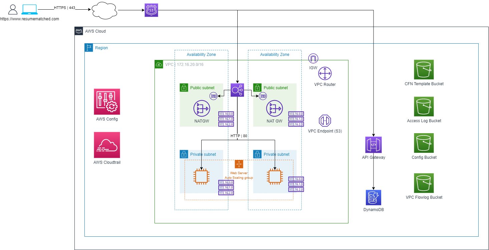

# Cloud-Native Marketing Workload 

## Business Use Description 

A new company would like to run a marketing campaign to develop prospects. Digital ads will be run on various platforms to raise awareness of the service. These ads will drive traffic to a landing page. The company will rely on the landing page to collect information from the visitors, and this information will be stored and used for analysis to continually improve the marketing campaign. Name, email, phone number, and location are examples of the data to collect.

## Technical Description

### User Journey To Landing Page

1. The user will browse to https://www.resumematched.com. 
2. The landing page will be returned and the user will be asked to submit their information.
3. After the data has been input, the user will hit submit and see a thank you message.

### Technical Journey of Landing Page

1. The www.resumematched.com domain name is aliased (via a CNAME record) to the public facing Application Load Balancer. Therefore, when a user browses to the website, this traffic is forwarded to the ALB.
2. The ALB has a Target Group, which is comprised of an multi-AZ Auto Scaling Group with EC2 instances. When the ALB recieves incoming traffic, it will forward the traffic to the instances in the ASG.
3. The instances will respond to the the request by serving the homepage of the website to the ALB, and the ALB forwards the response to the user's browser.
4. Using their browser, the user will input their information and click the submit button.
5. This information is sent to the API Gateway, which sends the data to DynamoDB where it will persist. 

### Architectural Details
 
There is a VPC with 2 Availibity Zones. Four subnets, two public, two private.

There is a CNAME record in Route 53 that points to the ELB. The user browses to https://www.resumematched.com. 

Using port 80, the Load Balancer sends the request to the EC2 Instances inside of the Auto Scaling Group located in private subnets. The EC2 Instances sends the landing page to the Load Balancer which serves it to the user. After the user submits their information, the data will go to an API Gateway. The data will go from the API Gateway to a DynamoDB table.

The Load Balancer security group accepts traffic on port 443 from users on the internet. The EC2 Instance application security group accepts traffic on port 80 from the Load Balancer

Two NAT Gateways, one in each public subnet just in case the EC2 instances need to reach the internet for updates or patches.

There are AWS Config rules in place to monitor the configuration of S3 Buckets, ELB & EC2 EBS Volumes.

The VPC S3 Endpoint is used to provide a private connection for the ALB to deliver access logs and for the EC2 Instances to download patches and bootstrap scripts.

There is a CloudTrail log to monitor amd record account activity.

Fuur S3 Buckets. One for each of the following: VPC Flow Logs, ALB Access Logs, New CloudFormation Templates & AWS Config recordings. The VPC Flow Logs, Cloudformation templates and AWS Config recordings buckets are all encrypted with AWS KMS keys. The ALB Access Logs bucket is encrypred with SSE:AES-256.

## Business Landing Page Link

Https://www.resumematched.com

## Template Order of Deployment

1. Governance Template
2. Networking Template
3. Compute Template
4. Application Template
5. Storage Template

